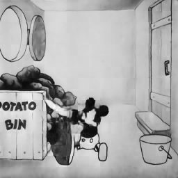
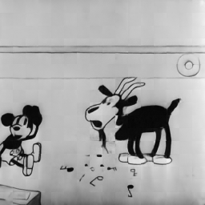
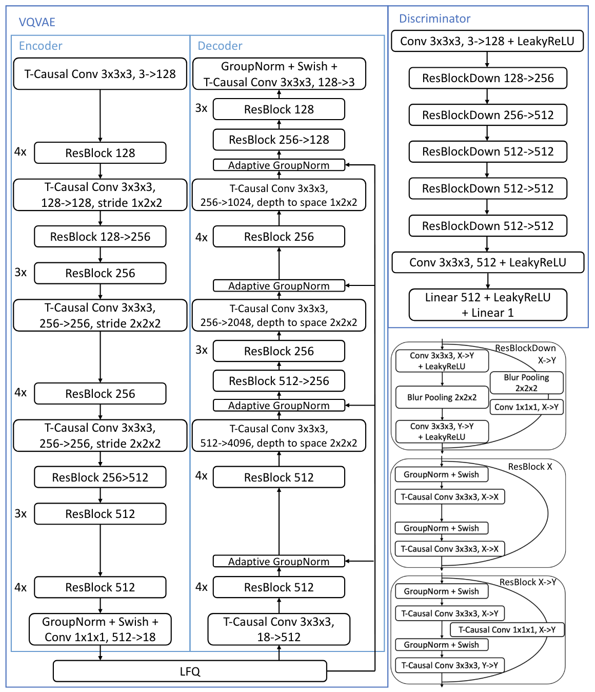

# Video Generation

NOTE: [MAGVIT2](notebooks/MAGVIT2.ipynb) is the notebook currently being worked on.

## Goal
**Build a video generation model which can generate novel scenes from Steamboat Willie**

This project was initially started because I had a naive idea for how I would build a video generation
model despite having never actually implemented even a vanilla VAE before. I had a high-level theoretical 
understanding of how VAEs worked, so I knew I could use one to learn good latent features of frames which could 
be fed into a transformer decoder for sequence modeling to get videos. After some digging, I found VideoGPT 
from 2021, which seemed to be the first video generation model to work in this way, so I knew my initial idea 
wasn't totally off from what the research community initially tried.

To familiarize myself with how to actually get VAEs to work well in practice, I implemented a VAE, VQ-VAE, and 
VQ-VAE-2 on CIFAR-10. I then modified the VQ-VAE from before to work with video clips to train it on 
Steamboat Willie. 

*best 16-frame, full spatial dimension reconstructions from VQ-VAE (without any codebook tricks)*:

I had some trouble with the VideoClips PyTorch tool taking too long to load clips, so I 
preprocessed the video clips and stored them as binary files for faster reads. While working on the VQ-VAE, I 
discovered Finite Scalar Quantization (FSQ) and liked the idea of it simplifying the whole quantization process 
and alleviating a lot of the training issues common in standard VQ-VAEs. I implemented it and used it in the now
FSQ-VAE, and trained that on the Steamboat Willie clips.

*best 16-frame, full spatial dimension reconstructions reconstructions from FSQ-VAE*:

Having seen the recently released Sora tech report from OpenAI, I liked the idea of operating on spatiotemporal
patches of the video, as it allowed for the model to handle variably shaped videos more easily. I could 
reassemble the patches back into video clips and get the full reconstructed clips back.

*current best tubelet reconstructions from FSQ-VAE (rearranged back into clips)*:

After finally getting some acceptable-looking recontructions, I fed the sequence of quantized encodings directly
into a transformer decoder which used FlashAttention2 with Sliding Window Attention along with ALiBi positional
encodings so I had the option of extending to longer sequences at inference time. This is where I found out I 
goofed up big time. The FSQ-VAE was simply not good enough at compressing the video clips, and the resulting
sequence was way too long. My transformer was also too small to generate coherent clips, and it quickly turned
into nonsense.

It was around this time I was recommended to check out VideoPoet from Google, which is the current
state of the art in autoregressive video generation. This model uses a video tokenizer called MAGVIT-v2, which is
the current state-of-the-art video tokenizer. So now, I have switched my approach to use this new MAGVIT-v2 
video tokenizer to get short video token sequences, and I am in the process of getting it to train effectively.

*16-frame 128x128 resolution reconstructions prior to proper adversarial loss*

## Dataset Source
Steamboat Willie source: https://archive.org/download/steamboat-willie-mickey

## MAGVIT2

This is a VQGAN style setup that uses a GAN loss to augment the FSQ-VAE reconstruction loss. The paper uses Lookup-Free Quantization, but I used Finite Scalar Quantization since 
it seemed to do well in other implementations of MAGVIT2 (and I've already implemented it). I have also been experimenting with Discriminators which take PatchGAN-style patches 
and spatiotemporal patches.

## Transformer Latent Sequence Model
For this, I will use FlashAttention2 in conjunction with the ALiBi positional encoder to efficiently model sequences while being able to extrapolate to longer sequences at inference time. I'm interested in both
Autoregressive generation and using iterative masked decoding methods like MaskGIT.

## Super Resolution Model
After we've mapped our generated sequence back into a 128 x 128 video, we can upsample the video frames to 256x256 (or maybe even 512 x 512?) to ensure our generated clip is tractable to learn and compute.

Heavy use/inspiration from the following work:

[VideoGPT](https://github.com/wilson1yan/VideoGPT)

[FSQ](https://arxiv.org/abs/2309.15505)

[MAGVIT](https://arxiv.org/abs/2212.05199)

[MAGVIT-V2](https://magvit.cs.cmu.edu/v2/)

[VideoPoet](https://research.google/blog/videopoet-a-large-language-model-for-zero-shot-video-generation/)
