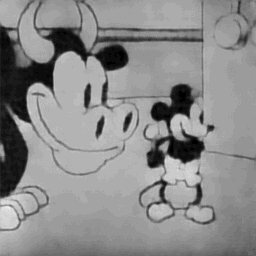
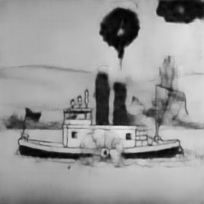
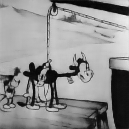

# VideoGPT
Implementation of VideoGPT

https://github.com/wilson1yan/VideoGPT

FSQ: https://arxiv.org/abs/2309.15505

Steamboat Willie source: https://archive.org/download/steamboat-willie-mickey

## Current Highlights
Here are some random example clip reconstructions from the validation set for FSQ-VAE

## Project Roadmap

- [X] Part 1: VAE (for knowledge/context) - CIFAR10

- [X] Part 2: VQ-VAE/VQ-VAE 2 (Conv2D) - CIFAR10

- [X] Part 3: VQ-VAE (Conv3D) - Steamboat Willie

- [X] Part 3.5: FSQ-VAE (Conv3D) - Steamboat Willie

- [ ] Part 4: Transformer Decoder - latent codes from Part 3

- [ ] Part 5: VideoGPT - put it all together

VideoGPT utilizes a two-model, two-stage approach

## FSQ-VAE/VQ-VAE (Visual Compression)
Clips from full videos are first used to train an FSQ-VAE/VQ-VAE with 3D Conv layers and (optionally) axial attention
allowing for a compressed, discrete representation of video data

I decided to try Finite Scalar Quantization, as I saw the paper come out around the time I 
was thinking about this project. I then proceded to run into almost all the problems it
mentioned with Vector Quantization, so I promptly replaced it with FSQ instead of attempting
all the hacky workarounds proposed to mitigate the issues.

## Transformer Decoder (Visual Prediction)
The resulting latent codebook is used as a vocabulary for a transformer decoder to learn to model sequences of
video frames in latent space

## Together - VideoGPT
Sequences of discrete latent vectors are predicted/generated by the Transformer Decoder and decoded back into
image space using the pre-trained VQ-VAE decoder
